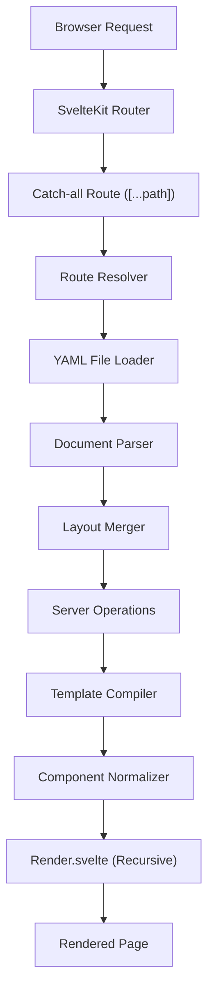
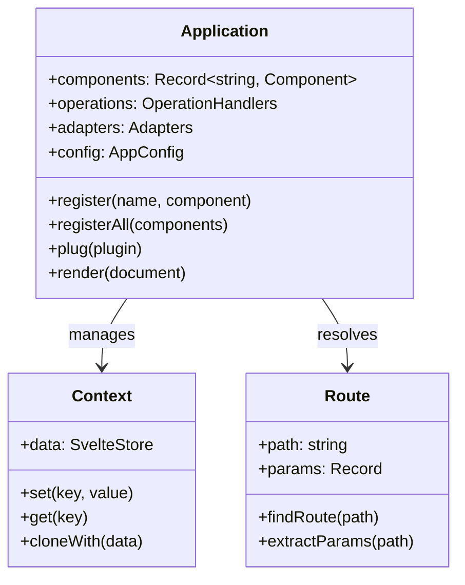
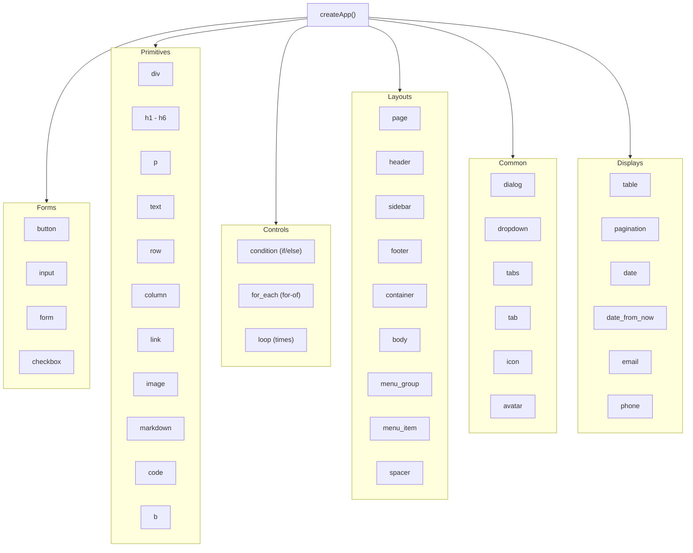
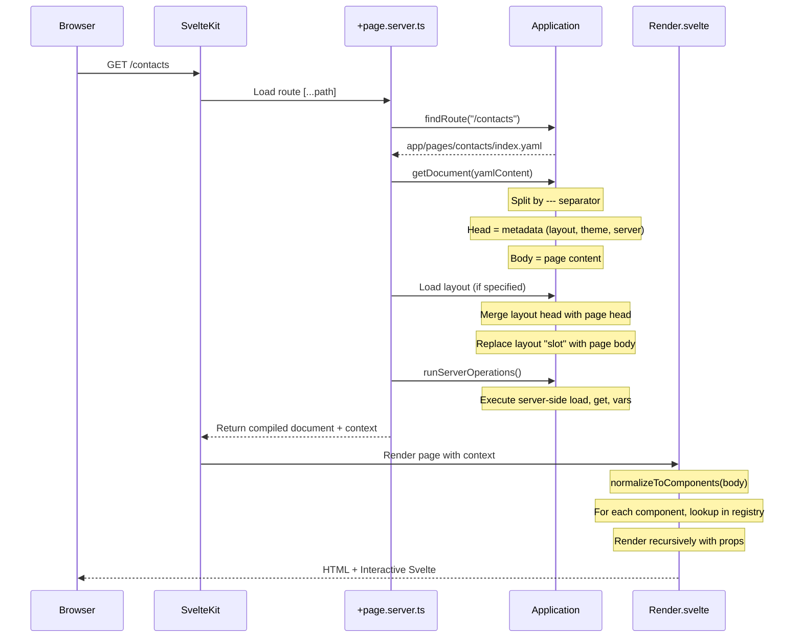
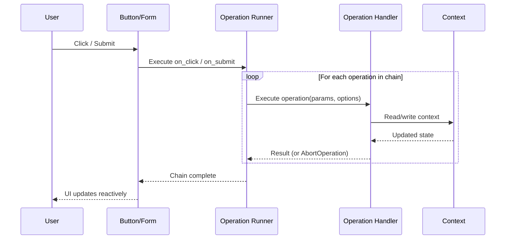
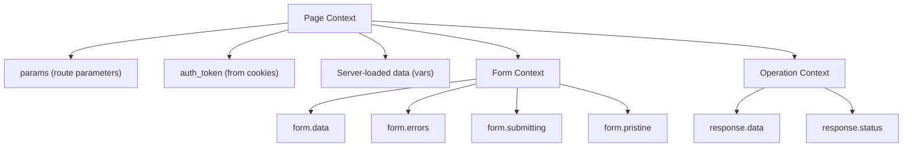
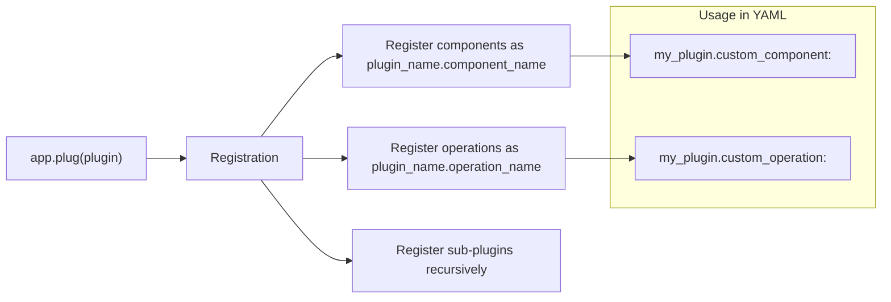
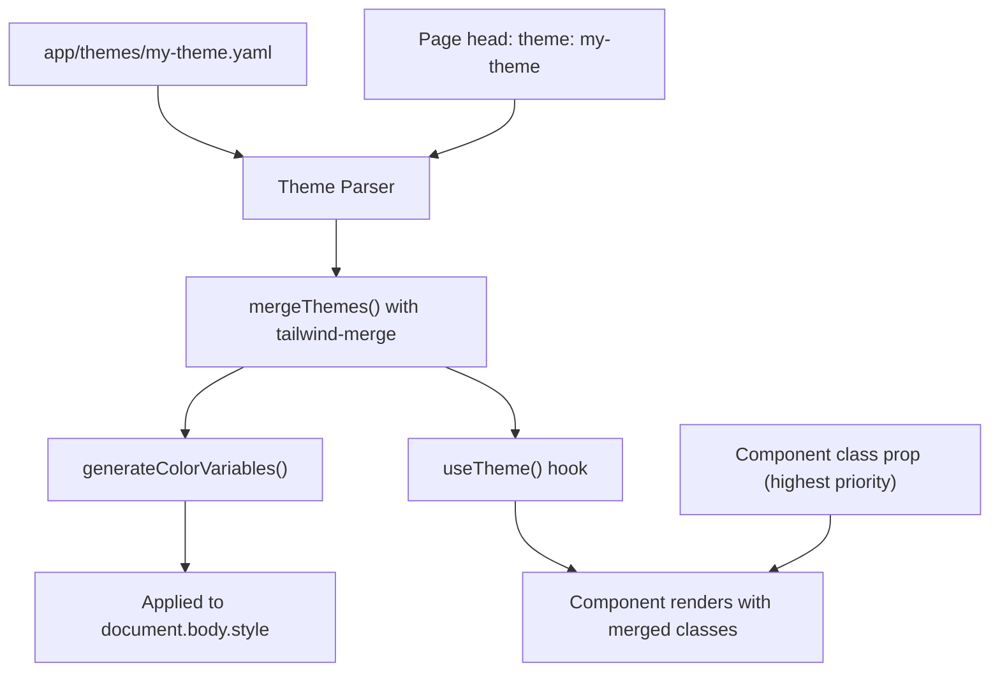

# Architecture

This document describes the internal architecture of Fluwy, how its systems connect, and how YAML files are transformed into rendered web pages.

## System Overview

Fluwy sits on top of SvelteKit and transforms YAML configuration files into a fully interactive web application at runtime.



## Core Architecture

The `Application` class is the central hub that ties everything together. It holds the component registry, operations registry, adapters, and plugin system.



## Component Hierarchy

Fluwy organizes its components into six categories, all registered at startup via `createApp()`:



## Rendering Pipeline

This is the step-by-step flow from a browser request to rendered HTML:



### YAML Document Structure

Every YAML page file follows this structure:

```yaml
# Head section (metadata)
layout: doc          # Which layout to use
theme: my-theme      # Which theme to apply
server:              # Server-side operations
  load:
    contact: https://api.example.com/contacts/${params.id}
---
# Body section (page content)
h1: Contact Page
p: ${contact.name}
```

The `---` separator divides the head (metadata) from the body (UI content).

## Operation Execution Flow

Operations are functions executed in sequence in response to events (clicks, form submissions, page loads, etc.):



### Built-in Operations

| Category       | Operations                                              |
|---------------|--------------------------------------------------------|
| HTTP          | `get`, `post`, `put`, `delete`, `load`                 |
| Navigation    | `goto`, `refresh`                                       |
| Auth          | `set_auth_token`, `unset_auth_token`, `authenticate`   |
| Forms         | `set_form_errors`, `clear_form_errors`                 |
| UI            | `open_dialog`, `close_dialog`, `notify`, `alert`       |
| Data          | `vars`, `log`, `extract`, `transform`                  |
| Cookies       | `set_cookie`, `remove_cookie`                          |
| Control       | `if`, `sleep`, `emit`, `abort`                         |

## Context and State Management

The `Context` object is a reactive store (powered by Svelte stores) that flows through the entire component tree. It is available on both server and client.



Components access context using `useContext()`, and operations can read/write context values. Template strings like `${contact.name}` are resolved against the current context.

## Plugin System

Plugins extend Fluwy with new components, operations, and sub-plugins. They follow a namespaced registration pattern:



### Plugin Interface

```typescript
interface Plugin {
  name: string;                              // snake_case plugin name
  operations?: Record<string, Operation>;    // Custom operations
  components?: Record<string, SvelteComponent>; // Custom Svelte components
  plugins?: Plugin[];                        // Sub-plugins
}
```

## Theming Flow

Themes are YAML files containing TailwindCSS classes. They are applied per-page or per-layout:



### Theme File Structure

```yaml
# app/themes/my-theme.yaml
colors:
  primary:
    DEFAULT: "#3b82f6"
    50: "#eff6ff"
    # ... 100-950

common:
  border_color: "border-blue-500"
  border_radius:
    sm: "rounded"
    md: "rounded-md"
    lg: "rounded-lg"

forms:
  button:
    variants:
      default: "bg-neutral-100 text-neutral-900"
      filled: "bg-color-500 text-white"
      outline: "border border-color-500 text-color-500"
      ghost: "text-color-500 hover:bg-color-50"
      link: "text-color-500 underline"

displays:
  table:
    header:
    row:
      default:
      clickable:
    pagination:
      wrapper:
```

## Key Source Files

| File | Purpose |
|------|---------|
| `src/lib/index.ts` | Main library entry, `createApp()`, component registration |
| `src/lib/core/app/index.ts` | `Application` class with registries |
| `src/lib/core/render.svelte` | Recursive component renderer |
| `src/lib/core/router/route.ts` | Filesystem-based route resolution |
| `src/lib/core/context/index.ts` | Reactive state management (Context) |
| `src/lib/core/operations/index.ts` | Operation system and built-in ops |
| `src/lib/core/utils/normalizers/normalize-to-components.ts` | YAML to component schema normalization |
| `src/routes/[...path]/+page.server.ts` | SvelteKit server-side route handler |
| `src/routes/[...path]/+page.svelte` | SvelteKit page wrapper component |

## Technology Stack

| Layer | Technology |
|-------|-----------|
| Framework | SvelteKit (Svelte 5) |
| Language | TypeScript |
| Styling | Tailwind CSS v4 |
| Build Tool | Vite |
| Package Manager | pnpm |
| UI Primitives | bits-ui |
| Markdown | marked |
| YAML Parsing | yaml |
| Icons | iconify-icon (icones.js.org) |
| Date Handling | dayjs |
| Toasts | svelte-sonner |
